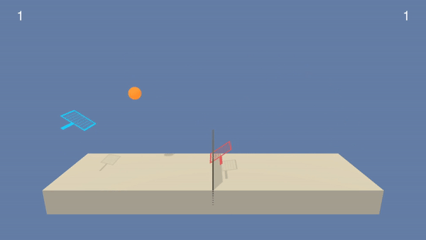
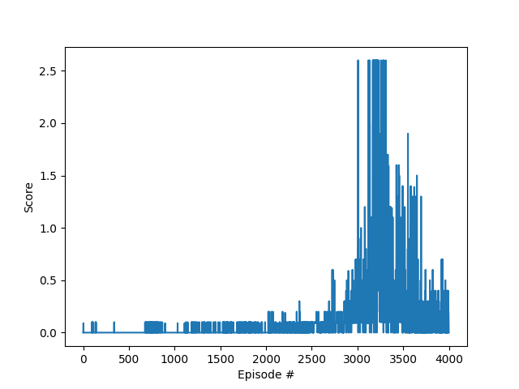

# Table of contents

- [Implementation](#implementation)
    - [Parameters](#parameters)
    - [Network architecture](#network-architecture)
    - [Learning algorithm](#learning-algorithm)
- [Results](#results)
- [Future Work](#future-work)

# Implementation

To solve the Tennis challenge, I implemented a
[Multi-Agent Deep Deterministic Policy Gradient](https://arxiv.org/abs/1706.02275)
architecture. Some hyperparameters used in this implementation are described below.

## Parameters

- `Actors Learning rate`: 1e-4 and 1e-4
- `Critics Learning rate`: 1e-4 and 1e-4
- `Step-size for soft update`: 1e-3
- `Discount rate`: 0.99
- `Update target every ... episodes`: 1
- `Minibatch size`: 256
- `Seed`: 42

In order to explore new actions, a Gaussian noise is added to the action determined by
the actor. To convey an exploitative attitude after learning more about the problem, the noise is
multiplied by a linearly annealed value. This value goes from 0.6 to 0.05 after 30000 time
steps.

## Network architecture

The model architectures used for the Actor and the Critic were the following:

- *Actor*:

1. `Linear(in_features=24, out_features=156)`
2. `ReLU()`
3. `BatchNorm1D()`
4. `Linear(in_features=156, out_features=156)`
5. `ReLU()`
6. `Linear(in_features=156, out_features=2)`
7. `TanH()`

- *Critic*:

1. `Linear(in_features=24, out_features=128)`
2. `ReLU()`
3. `BatchNorm1D()`
4. `Linear(in_features=130, out_features=100)`
5. `ReLU()`
6. `Linear(in_features=100, out_features=1)`

## Learning algorithm

The learning algorithm used was the MADPPG. 
This algorithm applies the DDPG algorithm to Multi-agent environments.
In this project, each agent had their own actor and critic.
The experience replay buffer was shared between them.
An experience consisted in both the agents' observations, actions, rewards and resulting states.
In this algorithm, the agent uses all the observations, actions and resulting states to learn 
about the environment. 
This way, it is possible to plan around the opponent's actions and to understand how their 
actions affect the other agents.

# Results

The environment was solved after `3086` episodes, achieving the average score of `0.5` over the
next `100` episodes.

After `3167` episodes, the agent manage to achieve a rolling average score of `0.997`. The gif below
showcases this performance

    
    
Agent trained with the average score of 35.0

The plot below describes the scores obtained during training.

    
    
Scores plot obtained during training

# Future work

To improve upon the knowledge I gathered throughout the Nanodegree, it is interesting to adapt 
this algorithm so that an agent is able to play as either color.
Another one of my goals is to implement MARL algorithms to different problems, such as 
the Soccer match, which mixes collaboration and competition.
